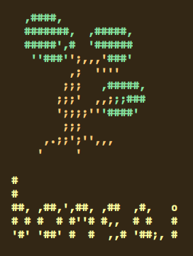

#  Install

#### Preface

This is a quick and dirty guide.  
Expect this to be fleshed out over many pages 
with lengthy explanations in the actual handbook.

----

1. **clone**

```sh
git clone http://github.com/bonsai-linux/bonsai
cd bonsai
```

2. **set chroot location**

```sh
export ROOT=/path/to/chroot
```

Decide where you want your chroot to be built.  
`bonsai` and its makefile reads this variable from the environment.

3. **build and install**

```sh
make
make install
```

The above will compile all the scripts into one executable, strip it of 
comments/blank lines, then install it to your `$ROOT` location.

5. **bootstrap**

```sh
./tools/bootstrap.sh
```

This will create dirs, assign permissions, and install the base system.  

Finally, it will relink your packages with `$ROOT=/` so symlinks will function inside the chroot.

6. **chroot**

`./tools/chroot.sh`

This will mount needed folders and chroot inside.

7. **exit**

Exit the chroot. Drives will be unmounted automatically.

----



If the above all completed successfully, **congratulations**!  
You have just installed your `bonsai` chroot!

----

### Post-Install

Many key programs will be missing from your chroot with only `@stage0` installed.  
Once chrooted in, you should then `bonsai @stage1` to finish your installation.
